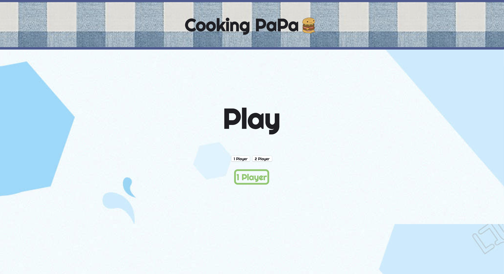
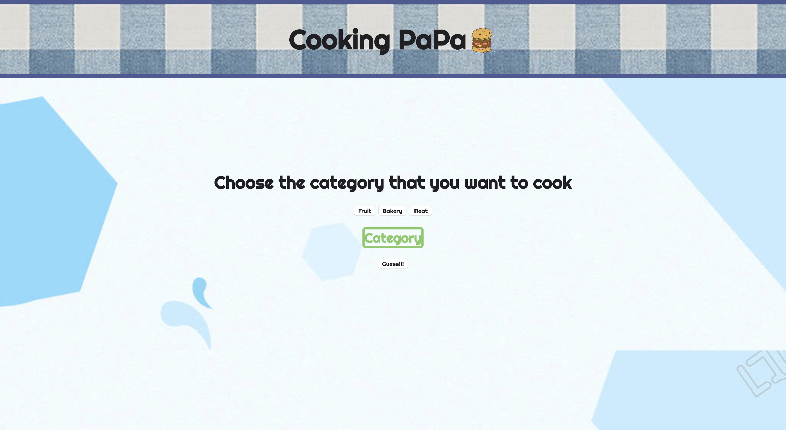
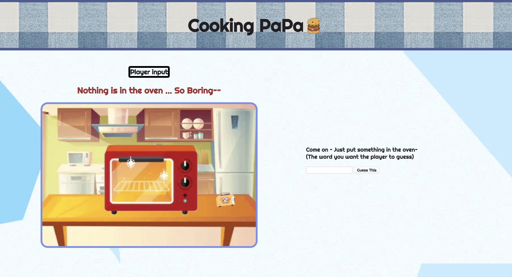
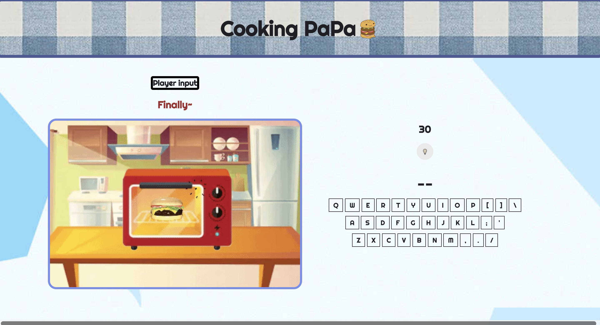

# Project-1-Hang-Man-KeeneWong

Description

<!-- What your project is / should be used for -->

https://keenewong.github.io/cookingpapa/

My name is cookingpapa. :)

Its a Game of papa cooking food to his son. (By typing the correct word)

It's like a branch of hangman.

Auctually the logic is the same.

Just follow the interface and CLICK to play!!!

<!-- What problem(s) your projects solves -->

Problem:

-sometimes css layer was messy when the number div are keep increasing.

-replace the multiple __ with the letter when plauyer got the right word.

-get the sound effect.

-deploy the website

-acess the object and array of food database

Brief

<!-- This could be a code snippet showing how your project should be used (if it is meant to be integrated into another app)
This could be a screenshot of your project running in the browser (if it is a stand-alone application) -->

Step 1:

choose the number of player by clicking the button on the home screen 

then click the play !!

Step 2:

One Player: Click on the category and pick one

then click guess button to play~

Two Player: Input a ord for player2 to guess

Step 3:

Guess the word by clicking the keyboard

If you click the wrong word, your danger score will keep adding on and if you reach 5. It's gameover.

Player have 30 second for guessing thw word.

But if you get all the word , you win.

List of Features / User Stories

<!-- This typically will be a short list of the features / user stories that you planned during the development phase of the project
To provide more detail, you can show how you categorized these features into Bronze (MVP), Silver, and Gold Levels and indicate which features you complete / have yet to complete -->

MVP:

Bronze:
the game is working
player can win with guess the right word
player can input word for other player to guess
button are working

Silver:
getting some css done (make it more presentable)
have some layer of div so that playrer can interact with the page more
having some animation
having some sound effect
timmer create
create array of food word for player to guess
fully developed game

Gold:
having stage score
Levels of word for player to choose
create some image and when player drop the image into the oven the word of image woild auto generated
having different food appear in the oven

Programming Skills used in this project

Javascript
CSS 
HTML5

Installation Instructions / Getting Started

If you are interested of helping me to developing this game more further :).
You can fork it in git hub.
1. Go to my github cookingpapa repo and fork it by click the clone button atr the top right corner.
2. clone it by copy the link and run the comment "git clone "the link" "
3. Open it locally at your computer and play around !!

Contribution Guidelines

<!-- This section should offer guidance on where and how users can contribute to your code, identify bugs, and propose improvements
Good links to include are:
A link to the project's main repository
A link to the project's issue tracker -->

My main repo: https://github.com/KeeneWong/cookingpapa
Issue tracker: https://github.com/KeeneWong/cookingpapa/issues
Feel free to find me :)
